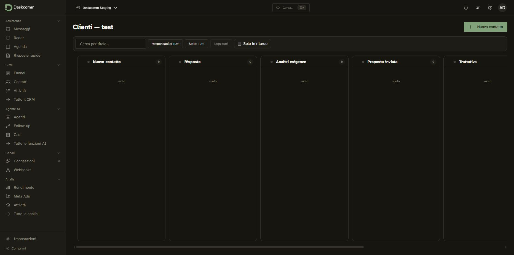

# DeskcommCRM — report staging

Data: 2026-10-03. Branch: `test/initial-evaluation`.

## Risultato

Baseline avviato; HTTPS, health completo, login e onboarding verificati.
URL: <https://deskcomm-staging.cristianocosta.it/login>.
Il login browser con gli accessi provvisori richiesti dall'utente e la prima
configurazione raggiungono `/app/inbox`. Onboarding **completato** dopo conferma
esplicita dell'utente per termini/privacy. Organizzazione `Deskcomm Staging`,
descrizione sintetica, fuso `Europe/Rome`, funnel `Clienti — test` con sette fasi
in italiano. Nessun numero WhatsApp collegato, dato cliente o provider AI.

Deployment tramite Docker Compose via SSH sul server Coolify, usando il Traefik
esistente. **Non registrato come risorsa applicativa nel pannello Coolify**:
redeploy e backup non sono gestiti dal pannello.

## Ambiente e audit prima/dopo

- Fork iniziale `6390a86338d86a93a086f6dd709a43a83d80cef6`, checkout pulito sul
  branch richiesto; fetch e merge `origin/main`: già aggiornato.
- Coolify `4.3.23`, pannello HTTPS autenticato `ssshh.cristianocosta.it`, server
  localhost pronto. SSH alias esistente `cosmo-builder`, host `vmi2912628`,
  IPv4 `89.117.61.169`. SSH verso il dominio proxato va in timeout; alias diretto
  verificato sul medesimo host. Ubuntu 24.04.5 LTS x86_64, 6 core,
  Docker 29.8.1, Compose 5.5.1.
- RAM 11960 MiB: disponibile circa 7106 MiB prima e 4899 MiB nell'ultimo controllo;
  swap assente. Disco `/` 96 GiB: 73 GiB usati/24 GiB liberi prima;
  81 GiB usati/16 GiB liberi, 84%, nell'ultimo controllo. Misure puntuali,
  non prove di capacità sotto carico.
- Snapshot protetto dei 27 container preesistenti prima del deployment.
  Confronto finale: **27/27 running con gli stessi ID; zero riavviati** dopo
  lo snapshot. Non costituisce verifica funzionale degli altri prodotti.
- `coolify-proxy` healthy, bridge esterna `coolify`, Internal=false;
  entrypoint `http=:80`, `https=:443`, resolver `letsencrypt`, HTTP challenge.
- Nessun Deskcomm preesistente trovato; nessuna modifica/riavvio del proxy
  globale, firewall, swap, daemon Docker o altri servizi; nessun cleanup globale.
- Cloudflare: aggiunto solo A `deskcomm-staging` → `89.117.61.169`, Solo DNS,
  TTL Auto, verificato nell'interfaccia e tramite risoluzione A.

## Baseline installato

Checkout `/opt/deskcomm-staging`, upstream stabile `v1.70.0`.
Oggetto tag annotato `38eb1fa8224c482ee3d616da4ce0b7544694c714`;
commit risolto verificato `cbf403e201627b49c0a9899f5a0cb5f12e02d975`.
Prod e Traefik coincidono con la release; SQL del branch differisce: bootstrap
con baseline e kit della release, senza build sul server.

Digest registry confrontati con immagini effettivamente scaricate:

| Immagine | Digest |
|---|---|
| `ghcr.io/melgarafael/deskcommcrm:1.70.0` | `sha256:26cdc7abca2aa47040fe8bc5a73b8b501cb70f2082d19c21b5d3f06f3600aea9` |
| `ghcr.io/melgarafael/deskcomm-worker:1.70.0` | `sha256:f623664343e5de43810ef47b1ae2bafd373ae9167a8780a3d601d803a4c88ce0` |
| `ghcr.io/melgarafael/deskcomm-scheduler:1.70.0` | `sha256:ec4d12831439fedc9263abb85cfd51d0523910a7f5364ba7250dfeccd81fbf7a` |
| `devlikeapro/waha:latest-2026.7.2` | `sha256:65e593e30bb702f891550b9da5d65e9e0eff8a926f5451fac6a582db84d3a323` |

WAHA usa un tag vendor con versione numerica, non il tag mobile `latest`.
Agente aggiornamenti automatici non installato.

## Supabase e isolamento

Scelta utente: Supabase self-hosted dedicato. Setup ufficiale
`self-hosted/v0.8.1`, coerente con il kit; SHA256 setup scaricato:
`848973911bd5fa03dfd714b67bff4132e49b1b7777b6edb6ab0a9d9e85bc813c`.

- Progetti Compose `deskcomm-staging` e `deskcomm-staging-supabase`, rete dedicata
  `deskcomm-staging_supabase`, nomi e volumi separati.
- CRM: prod + single-server + Traefik + overlay staging. Caddy e voce esclusi.
- Supabase: Compose ufficiale + override single-server del kit (reset nomi
  container globali) + overlay staging. Gateway solo `127.0.0.1:18080` sul host:
  porta 8000 occupata da Coolify. Nessuna porta DB/pooler pubblicata.
- App e gateway Supabase sulla rete proxy `coolify`; router gateway dedicato
  priorità 100 limitato ai prefissi SDK `/auth/v1`, `/rest/v1`, `/realtime/v1`,
  `/storage/v1`, `/functions/v1`, `/graphql/v1`. Studio, DB, Redis e WAHA non
  pubblicati sul host. Nessuna modifica ai router preesistenti.
- URL pubblico Supabase sul dominio HTTPS staging, callback `/auth/confirm`.
  Signup pubblico GoTrue disabilitato. Amministratore bootstrap con email
  confermata; password provvisoria sostituita su richiesta e provata nel browser.
- Bootstrap riuscito: 193 tabelle pubbliche, estensioni `vector`, `citext`,
  `pg_trgm`, bucket privato `whatsapp-media`, un utente Auth, superadmin e
  organizzazione bootstrap. Nessun progetto Supabase esistente modificato.
- `.runtime` 700, `.env` e credenziali 600 sul server. Segreti e risposte Auth
  non versionati. SMTP assente: inviti, email e reset password non provati.

Limiti reali verificati via Docker inspect su tutti i nuovi container:

| Servizio CRM | RAM massima | CPU |
|---|---:|---:|
| app | 768 MiB | 1.5 |
| worker | 512 MiB | 1 |
| WAHA | 1280 MiB | 1 |
| scheduler | 192 MiB | 0.25 |
| Redis / SRH, ciascuno | 128 MiB | 0.25 |

Supabase: tutti gli 11 servizi con limiti, RAM totale massima 3200 MiB,
DB 768 MiB/1 CPU; dettaglio nell'overlay. Massimi RAM dei due stack 6208 MiB,
non una prenotazione o un limite CPU aggregato. Nessun OOM staging osservato.

## Prove effettive

| Prova | Esito |
|---|---|
| HTTP dominio | 301 verso HTTPS |
| HTTPS root senza sessione | 307 verso login |
| HTTPS login | 200, certificato validato senza bypass |
| GoTrue health con anon key | 200 |
| Login API Auth | 200, autenticato, email confermata |
| Login browser password provvisoria | successo; completata configurazione iniziale |
| Onboarding completo | successo, termini/privacy accettati dopo conferma; WhatsApp, AI, test AI e inviti saltati |
| Persistenza organizzazione | SQL: `Deskcomm Staging`, `Europe/Rome`, `onboarded_at` valorizzato, accettazione registrata |
| Navigazione CRM | inbox vuota e funnel `Clienti — test` aperti nel browser; sette fasi salvate visibili |
| `/api/v1/health` autenticato | 200 healthy, versione 1.70.0, Supabase/Redis/WAHA ok anche dopo applicazione limiti |
| Webhook globale `/api/v1/webhooks/waha` esterno | 403 |
| WAHA sessioni interne | 200, zero sessioni |
| CRM | 6 running; app, worker, scheduler, Redis healthy; WAHA/SRH senza healthcheck Docker |
| Supabase | 11 running, tutti healthy |

Nessun 404 generico Traefik sulle rotte provate. Non provati WhatsApp inbound/
outbound, AI, RAG, automazioni, MCP, inviti, backup/restore o capacità sotto carico.

## Problemi risolti

1. Porta 8000 occupata: gateway loopback 18080.
2. Umask 077 rendeva gli SQL montati illeggibili da Postgres: fermato solo il
   nuovo Supabase; preservati dati parziali in `.runtime/supabase-partial-init-20261003`;
   directory config 755, file 644, script 755, mantenendo privati genitore e env.
   Nuova inizializzazione completa riuscita.
3. SDK browser richiede API pubbliche Supabase: router per soli prefissi SDK,
   senza esporre Studio o DB.
4. Copia operativa installer adattata: interrompe pull fallito, usa `--no-build`,
   salta cron host updater/drain. Scheduler della release esegue già drain.
5. `_common.sh` ridefinisce `dc()` e perde l'overlay aggiuntivo del wrapper:
   applicato esplicitamente il quarto Compose dopo bootstrap, verificati limiti
   effettivi con inspect. Non affidarsi al wrapper iniziale.

[Istruzioni operative e overlay](../deployment/staging/README.md).

## Arresto e prossimo passo

Fermati al baseline funzionante con prima configurazione completata. Utente può
cambiare password provvisoria e accedere direttamente al CRM.
Configurare SMTP, collaudare backup/restore e valutare disco/capacità prima di
uso operativo. Gestione nativa Coolify ancora da implementare, senza sostituire
implicitamente questo stack.

Richiesta successiva dell'utente: tradurre e pubblicare l'interfaccia italiana.
Il baseline iniziale portoghese è stato mantenuto come riferimento; la successiva
pubblicazione dell'italiano è descritta nella verifica dedicata in fondo al report.
Catalogo, grafo, Novità e impostazioni lingua aggiornati senza nuove feature di CRM.

## Provenienza

Prove live: SSH, Docker/Compose, curl TLS, browser staging, Coolify, Cloudflare;
Git/GitHub/GHCR per versioni. File locali: CLAUDE.md, AGENTS.md, skill
 deskcomm-instalar/deskcomm-doutrina, handoff, runbook e kit della release.
Web ufficiale: <https://supabase.com/docs/guides/self-hosting/docker>.
Wiki come contesto, non prova corrente:
`wiki/concepts/coolify-supabase-db-access.md`,
`wiki/analyses/workpress-proxy-coolify-deploy-procedure.md`,
`wiki/analyses/fondazione-fundraise-cf-template-deploy-2026-05-10.md`.

## Verifica successiva del selettore geografico

Utente segnala errore all'apertura di “Onde você atende”, con ID
`88a72c69c435430993f8eab9f851b320`. ID non trovato nei log app recenti;
nessuna eccezione server corrispondente rilevata nella finestra controllata.
Il componente di errore client genera ID Sentry anche quando l'invio non è
configurato: l'ID da solo non fornisce lo stack del telefono.

Prova browser reale, pagina originale portoghese: apertura menu e selezione
Roma riuscite sia con viewport normale sia 390×844. Viewport ripristinato dopo
la prova. Non è una verifica su Safari/Chrome del telefono dell'utente e non
riproduce un'eventuale traduzione automatica della pagina. Causa ancora aperta;
non dichiarata corretta e nessuna patch applicata senza riproduzione.

Dopo conferma esplicita dell'utente, modulo inviato: nome `Deskcomm Staging`,
descrizione `Ambiente di valutazione CRM con dati sintetici, senza clienti reali.`,
fuso `Europe/Rome` (Roma). Onboarding completato, confermato sia nell'inbox sia
nel DB. Funnel predefinito `Clienti — test`, fasi: Nuovo contatto, Risposto,
Analisi esigenze, Proposta inviata, Trattativa, Concluso, Perso; tutte visibili
nel quadro salvato, zero lead. WhatsApp, AI, test AI e inviti saltati senza
connessioni, chiavi o invii. Verifica finale health alle 21:44 UTC: healthy;
11 servizi Supabase healthy, sei CRM running (quattro con healthcheck healthy),
27/27 container preesistenti con stessi ID running e zero riavviati.

## Pubblicazione interfaccia italiana — 4 ottobre 2026

Richiesta autorizzata dall'utente: traduzione integrata e pubblicazione sullo
staging esistente. Nessun redesign, refactoring di business o nuovo collegamento.

### Fonte e versione distribuita

- Base stabile upstream v1.70.0, commit
  `cbf403e201627b49c0a9899f5a0cb5f12e02d975`; non `latest`.
- Patch di presentazione del fork, commit
  `c64b8597d41f6fd18000e7b35056ec0dc3b0967c`.
- [CI completata con successo](https://github.com/ilpiratacris/WhatsApp-DeskcommCRM/actions/runs/37159364562):
  typecheck, lint (zero errori, 489 warning preesistenti), 50 test in sette file,
  build Docker della fonte stabile con catalogo italiano.
- Immagine `deskcomm-staging-it:c64b8597d41f6fd18000e7b35056ec0dc3b0967c`;
  ID `sha256:555e659c10b7823787c97a860b586efc75b359832f017b834d502c1cee3ae8ad`.
- Versione health: `1.70.0-it.c64b8597d41f6fd18000e7b35056ec0dc3b0967c`.
- Pubblicazione via SSH/Docker Compose sotto il Traefik di Coolify già esistente,
  sostituito soltanto `app` con gli stessi quattro file e `--no-deps --no-build`.
  Worker e scheduler mantengono l'immagine stabile originale. Nessuna migrazione.

### Verifiche effettuate

Health autenticato del 3 ottobre alle 22:53:51 UTC (4 ottobre 00:53 in Italia):
HTTP 200, `healthy`; Supabase, Redis e WAHA `ok`. Healthcheck container app healthy.
TLS verificato con validazione del certificato, senza bypass.

Browser reale: selettore italiano disponibile, preferenza salvata e confermata dopo
reload, navigazione Messaggi, Contatti, Impostazioni, Profilo, Connessioni ed elenco
funnel; quadro `Clienti — test` con sette fasi vuote. Nella versione finale verificati
nuovamente il quadro, `Lingua: Italiano`, titolo CRM e le impostazioni con
Fatturazione, Identità visiva e Trunk SIP. Organizzazione `Deskcomm Staging`
aggiornata a locale `it` (una riga); nessun dato cliente modificato.
Pagina login pubblica HTTP 200 e testo `Accedi` con `Accept-Language: it-IT`.
Sessione autenticata esistente utilizzabile: non ripetuto un nuovo login da smartphone.
Onboarding già completato nel baseline, non azzerato o reinviato.

Snapshot prima/dopo: **43/43 container diversi dall'app**, stessi ID e stessi
`StartedAt`, nessun riavvio. Include i 27 servizi preesistenti e gli altri servizi
staging. Gli 11 servizi Supabase dedicati sono healthy. Webhook globale esterno
403 dopo la prima pubblicazione. Nessun numero collegato nella schermata Connessioni;
nessun invio WhatsApp, invito, credenziale AI o dato sensibile aggiunto.
Disco dopo caricamento: circa 18 GiB liberi, 83% utilizzato; nessuna prova sotto carico.

### Copertura, limiti e ripristino

Catalogo di 8.889 testi, traduzione assistita offline e revisione manuale delle
etichette e descrizioni principali. Test di copertura menu, segnaposto, link,
normalizzazione lingua e date. Non è una revisione editoriale completa delle 8.889
frasi: testi secondari possono richiedere miglioramenti. Titoli della scheda browser
rimangono in parte portoghesi (metadata upstream); contenuti utente, documenti legali,
email e manifest di estensioni esterne non diventano automaticamente italiani.
Nessuna verifica sull'effettivo telefono dell'utente.

Documentazione di implementazione/rollback: [ITALIANO.md](../deployment/staging/ITALIANO.md).
Backup privato env originale: `/opt/deskcomm-staging/.runtime/env-before-italiano-20261004`.
Ripristinarlo e riavviare soltanto app con gli stessi quattro Compose per tornare
all'immagine stabile originale. Catalogo e locale `it` sono preferenze reversibili;
con la release originale un locale sconosciuto ricade sul portoghese.
Grafo aggiornato in `docs/architecture/italiano.architecture.json`; Novità nel
Changelog non rilasciato e fragment `.changes/italiano-staging.md`.
Gestione funzioni: nessun nuovo interruttore, lingua nelle impostazioni esistenti.

Fermata alla pubblicazione italiana verificata. Restano aperti SMTP,
backup/restore collaudato, capacità sotto carico e gestione nativa dello stack
nell'interfaccia Coolify, come nel baseline. La password provvisoria va cambiata
dall'utente attraverso il profilo; nessuna credenziale riportata in questo report.

Provenienza di questo aggiornamento: file locali del fork e release stabile;
prove live SSH, Docker, TLS e browser; GitHub Actions per build/test. Wiki
`wiki/concepts/coolify-supabase-db-access.md` usata come contesto operativo,
non come prova del deployment corrente.
## Manutenzione Graft e integrazione main — 4 ottobre 2026

Su richiesta dell'utente, il fork usa Graft 0.21.1 per mantenere aggiornato il
grafo di dipendenze. Aggiunti `pnpm graft:build`, `pnpm graft:check`, istruzioni
in AGENTS/CLAUDE e [runbook](../runbooks/graft.md). Il grafo locale è ignorato
da Git e non sostituisce i contratti architetturali versionati.

Build locale verificato: 5.116 file analizzati, 26.054 nodi, 71.488 archi.
`pnpm graft:check` superato: wiring graph in sync. Tier semantico non costruito,
coerentemente con l'uso senza `--deep`. `git diff --check` superato.
Parsing senza passaggio LLM `--deep`, senza modifiche globali degli assistenti.
Nessuna funzione amministrativa da aggiungere: lo strumento serve allo sviluppo.
Il lavoro staging/italiano e questa configurazione sono destinati a `main`
con push ordinario, senza riscrivere la storia. Verificare lo SHA pubblicato
con `git ls-remote origin refs/heads/main`.

Push effettuato e SHA remoto confrontato con HEAD:
`19f8aca8b8520e499cdf09eef7af85b90d6d7bc7`, coincidenti; albero pulito e
`HEAD...origin/main` = `0 0`. Controlli GitHub avviati, non ancora completati
al momento della verifica. Il workflow `release` (run 37160504414) fallisce
in `actions/create-github-app-token@v3`: identificativo App vuoto
(`RELEASE_APP_ID` non disponibile nel contesto). Non è stata tagliata una
nuova release; configurare l'App del fork richiede una fase dedicata.

Questa fase non include un nuovo deploy o una nuova verifica live del CRM.
Resta valida l'evidenza staging riportata sopra; i gate operativi aperti non
sono chiusi dal push Git. I workflow del fork su main possono costruire immagini;
lo staging usa l'immagine stabile italiana fissata nel proprio ambiente.

## Revisione funzionale italiano — 4 ottobre 2026

Correzione dei testi in base ai comportamenti e agli stati del codice, senza
modifiche a schema, canali o funzioni. [Metodo e limiti](../deployment/staging/ITALIANO-REVISIONE.md),
con elenco prima/dopo versionato: 735 voci, 521 editoriali e 214 terminologiche.
Test aggiunti sulla diagnostica reale Google con invio attivo/disattivato e
sugli attributi eseguibili del tracciamento. Aggiornati Novità e contratto
architetturale; nessuna nuova funzione da inserire nel pannello amministrativo.

### Evidenze della revisione pubblicata

- Commit del codice: `7e0d18dcf54099eda6160ebb54760cd0ec9bf7bd`.
- [Workflow staging 37162939077](https://github.com/ilpiratacris/WhatsApp-DeskcommCRM/actions/runs/37162939077): successo. Typecheck superato; lint 0 errori e 489 avvisi già presenti; 7 file di test e **54 test superati**. Primo run 37162793265 annullato per includere la correzione delle intestazioni CSV.
- Base dell'immagine: release stabile **1.70.0**, commit upstream `cbf403e201627b49c0a9899f5a0cb5f12e02d975`, con overlay della presentazione italiana; non `latest`.
- Graft rigenerato: 5.116 file, 26.055 nodi, 71.491 archi. `pnpm graft:check` superato; tier semantico `--deep` non costruito.
- SHA256 archivio Docker locale e remoto coincidente: `e821785709a2e441c63b3b00b6eb07f7d1766f44c07ce57f19e66c25fa34f34d`.
- Immagine attiva: `deskcomm-staging-it:7e0d18dcf54099eda6160ebb54760cd0ec9bf7bd`, con pull disattivato. Compose prod + single-server + traefik + staging, `--no-deps --no-build app`; ricreato solo `deskcomm-staging-app-1`.
- Verifica delle 00:04 UTC del 4 ottobre: `/api/v1/health` pubblico HTTP 200, `healthy`, versione `1.70.0-it.7e0d18dcf54099eda6160ebb54760cd0ec9bf7bd`, Supabase/Redis/WAHA `ok`; app Docker healthy. TLS verificato senza disabilitare il controllo del certificato.
- 44 container running prima e dopo: gli altri **43** mantengono gli stessi ID, orari di avvio e stato. Comprendono gli altri 5 servizi CRM, gli 11 Supabase dedicati e i 27 servizi estranei allo staging. Gli 11 container Supabase risultano healthy.
- `/login` HTTPS HTTP 200. Sessione browser autenticata esistente mantenuta dopo il deploy; non è stata rieseguita l'immissione delle credenziali.
- Browser: verificati menu distinti «Attività da svolgere» / «Registro delle attività», «Ricontatti automatici», contatti, finestra CSV con colonne originali e azione «Importa», etichetta «Nome della fase» nel funnel. Nessuna importazione o modifica dei dati.
- [Prova visiva CSV](../deployment/staging/italiano-revisione-live.jpg), acquisita dopo il deploy. Il primo accesso è stato rivisto sul codice, senza riavviare l'onboarding dell'organizzazione già configurata.
- Backup ambiente e confronto container conservati sul server sotto `.runtime`, senza credenziali nel repository. Nessun numero WhatsApp reale o provider IA aggiunto.

La qualità editoriale completa resta aperta per i moduli specialistici e le frasi fuori dall'elenco; copertura delle chiavi e passaggio dei test non la certificano. Gli invii WhatsApp, le conversioni pubblicitarie e il comportamento dei provider non configurati non sono stati provati live. Il problema preesistente del workflow `release` del fork (`RELEASE_APP_ID` assente), descritto sopra, resta separato da questo workflow staging superato.

Integrazione e push ordinario su `main`: da registrare dopo il confronto remoto.
